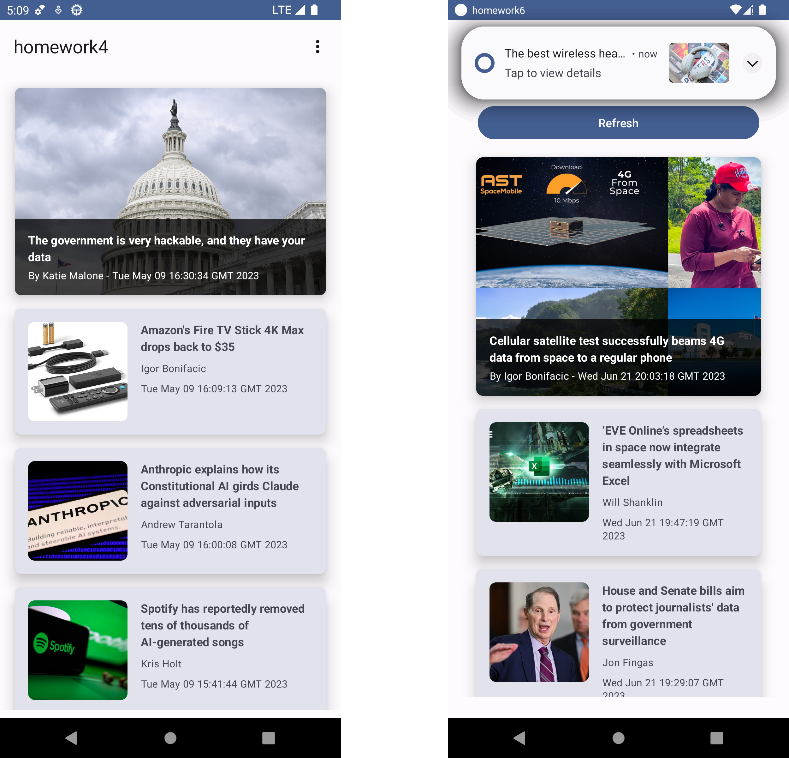

# AAD Assignments 3-6

This mobile app displays recent news from a RSS Newsfeed. It uses proper MVVM state
management and all news data is being cached in a local `SQLite` database. If a new article is
available the user is notified via a `Notification`.

Furthermore, the app allows the user to set some settings and uses the local device theme as app theme in
accordance to Googles' new [Material You](https://material.io/blog/announcing-material-you)
design philosophy.

It uses:

* Jetpack Compose
* MVVM Architecture
* ViewModels to persist data across configuration changes
* `coil` for asynchronous image fetching
* `datastore` for persisting user preferences
* `Room` for local `SQLite` caching of news data
* `Workers` for background syncing of news data and posting `Notifications`

For details have a look at the separate [assignments](assignments).
