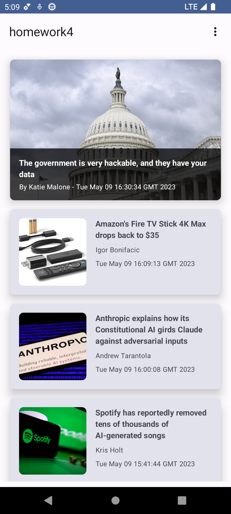

# Homework 3 & 4

This app fetches some data from an RSS Newsfeed API and displays it with proper state
management. It allows the user to set some settings and uses the local device theme as app theme in
accordance to Googles' new [Material You](https://material.io/blog/announcing-material-you)
design philosophy.

It uses:

* Jetpack Compose
* MVVM Architecture
* ViewModels to persist data across configuration changes
* `coil` for asynchronous image fetching
* `datastore` for persisting user preferences

For details have a look at this [assignment](Homework3.pdf) and at this [assignment](Homework4.pdf).
